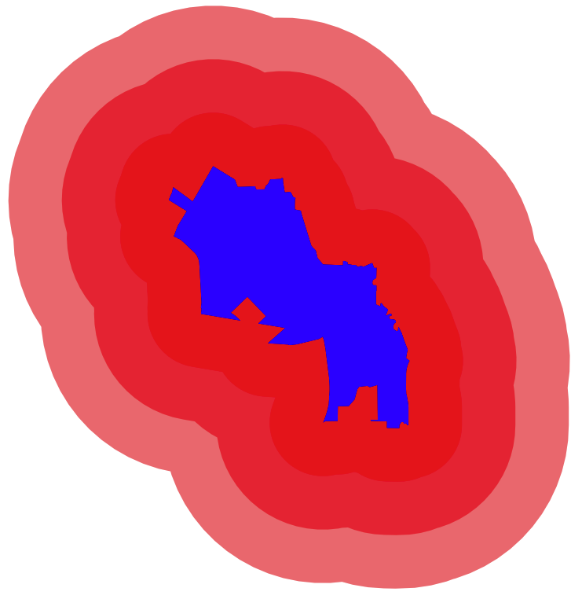
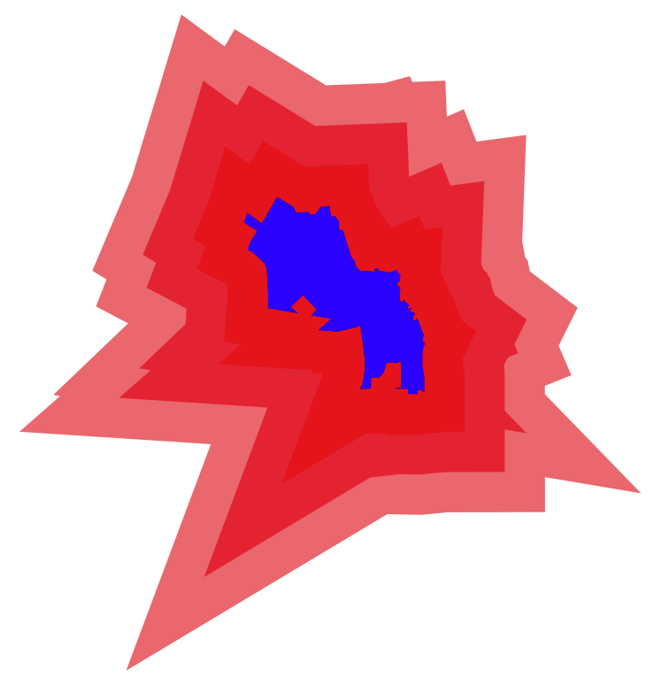
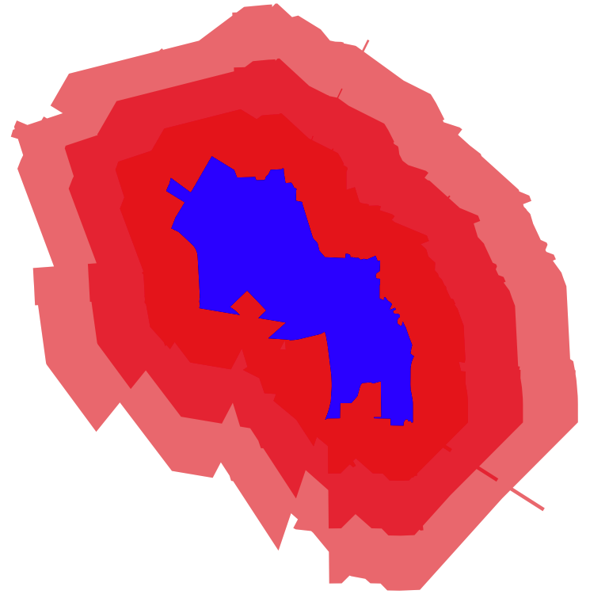

# Applying buffers in Geopandas

Buffering is a common method to expand a given geometry beyond its existing contours to capture and visualize a larger area. Technically speaking, buffering can produce varying results depending on the algorythm applied during the actual computation. Geopandas' buffer function has three "styles," and the following guide displays the results of each one applied on a polygonial shape.

## Join Style 1

```python
fig, ax = plt.subplots(figsize=(15,15))
gdf.buffer(2000,join_style=1).plot(ax=ax,color='red',alpha=0.5)
gdf.buffer(4000,join_style=1).plot(ax=ax,color='red',alpha=0.5)
gdf.buffer(6000,join_style=1).plot(ax=ax,color='red',alpha=0.5)

gdf.plot(ax=ax,color='blue')
```



## Join Style 2
```python
fig, ax = plt.subplots(figsize=(15,15))
gdf.buffer(2000,join_style=2).plot(ax=ax,color='red',alpha=0.5)
gdf.buffer(4000,join_style=2).plot(ax=ax,color='red',alpha=0.5)
gdf.buffer(6000,join_style=2).plot(ax=ax,color='red',alpha=0.5)

gdf.plot(ax=ax,color='blue')
```



## Join Style 3
```python
fig, ax = plt.subplots(figsize=(15,15))
gdf.buffer(2000,join_style=3).plot(ax=ax,color='red',alpha=0.5)
gdf.buffer(4000,join_style=3).plot(ax=ax,color='red',alpha=0.5)
gdf.buffer(6000,join_style=3).plot(ax=ax,color='red',alpha=0.5)

gdf.plot(ax=ax,color='blue')
```

